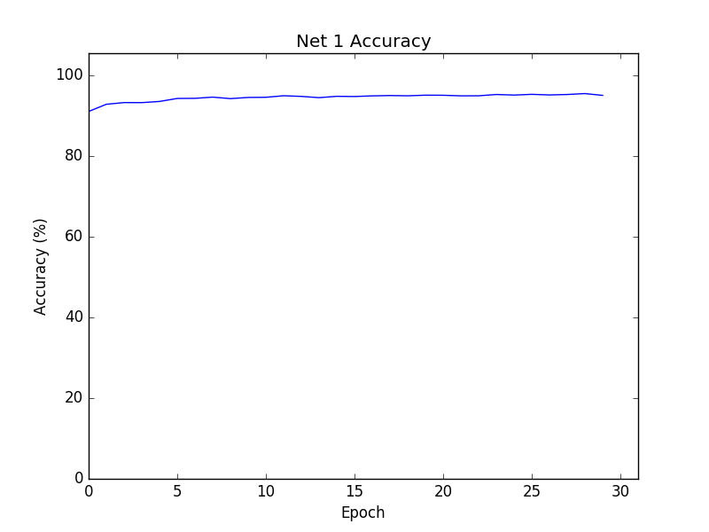

# Deep learning practice using the MNIST package

## Network 1



Network 1 is trained on the MNIST dataset. The initial accuracy can be attributed to chance since, at the beggining, 
the weights and biases are randomly sampled from a Gaussian. 

The cost used in training the network is a simple cost function - 
`cost.SimpleCost`. The cost function subtracts the desired prediction vector (vector of size 10 with a 1 in the place 
that corresponds with the desired output) from the vector of activations of the last layer.

Sample activation vector:
```
[[9.66333485e-02]
 [8.65224133e-04]
 [1.23495401e-01]
 [2.08411913e-05]
 [4.18944678e-03]
 [1.14895278e-01]
 [3.07330600e-03]
 [1.02905146e-01]
 [1.25220421e-02]
 [5.39137800e-02]]
``` 

Sample prediction vector:
```
[[0.]
 [0.]
 [0.]
 [0.]
 [1.]
 [0.]
 [0.]
 [0.]
 [0.]
 [0.]]
```

##### Michael Nielsen's [deep learning book](http://neuralnetworksanddeeplearning.com) - a great introduction to deep learning using the MNIST package.
