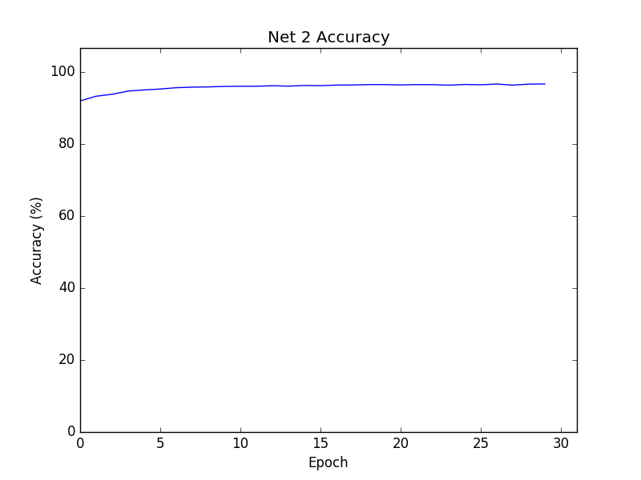

# Deep learning practice using the MNIST package

Several example networks trained to recognize MNIST digits. The networks' implementation increases in complexity from 
Network 1 to the Convolutional Neural Networks. The main difference between the networks is architecture and the cost 
function.

## Network 1


Network 1 is trained on the MNIST dataset. The initial accuracy can be attributed to chance since, at the beggining, 
the weights and biases are randomly sampled from a Gaussian. The chart represents the accuracy on the test dataset, not 
on the evaluation data set.

The cost used in training the network is a simple cost function - 
`cost.SimpleCost`. The cost function subtracts the desired prediction vector (vector of size 10 with a 1 in the place 
that corresponds with the desired output) from the vector of activations of the last layer.

Sample activation vector:
```
[[9.66333485e-02]
 [8.65224133e-04]
 [1.23495401e-01]
 [2.08411913e-05]
 [4.18944678e-03]
 [1.14895278e-01]
 [3.07330600e-03]
 [1.02905146e-01]
 [1.25220421e-02]
 [5.39137800e-02]]
``` 

Sample prediction vector:
```
[[0.]
 [0.]
 [0.]
 [0.]
 [1.]
 [0.]
 [0.]
 [0.]
 [0.]
 [0.]]
```

## Network 2



Network 2 is trained on the MNIST dataset. The cost used in training the network is the Cross-Entropy cost.

# Limitations

- Random Gaussian sampling for initialization of weights and biases; a consistent initialization could make the results 
more replicable;
- Accuracy should not be the only reported metric; what other metrics could be reported? Cost, etc.
- The CNN implementation uses Theano; would a TensorFlow implementation improve the results?

##### Michael Nielsen's [deep learning book](http://neuralnetworksanddeeplearning.com) - a great introduction to deep learning using the MNIST package.
